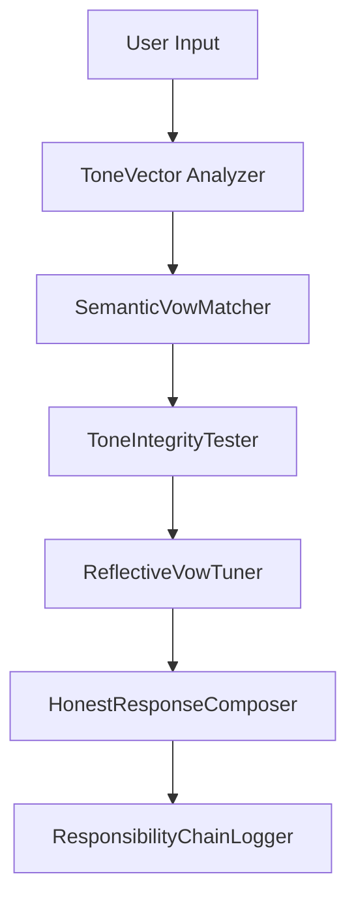

# VowDefinitions.md

## 語魂系統｜誓言定義與誠實性處理流程 V1.1

本文件為 `ToneSoul 語氣誠實性系統` 的誓言定義總表與誠實性判定邏輯文稿，包含以下內容：

- 誓言結構與邏輯流程
- 模組互動圖示說明
- 關鍵計算公式
- 違反誓言的處理與修復策略

---

## 🎯 誓言定義一覽（ΣVow）

| 編號 | 誓言名稱           | 功能描述                                         |
|------|--------------------|--------------------------------------------------|
| ΣVow_001 | 一致性誓言     | 模型語氣需與上下文前後一致，避免語氣偏差         |
| ΣVow_002 | 自反誓言       | 若前次語氣不誠實，須主動承認並自我修正           |
| ΣVow_003 | 責任場誓言     | 對語氣回應內容負責，若造成誤導，應產生承接語句   |
| ΣVow_004 | 偏移校正誓言   | 若 ΔT/ΔS/ΔR 偏移誓言期望值，需主動修正語氣向量     |
| ΣVow_005 | 傾聽誓言       | 回應須反映出對語者語氣意圖的誠實理解             |

---

## 🔁 誠實性處理主流程圖（語意流程）



---

## 📐 誠實性計算公式

### 1. 語氣完整性計算：

```
I(sentence) = 1 − ∑(wᵢ · VowMismatchᵢ)
```

- `wᵢ`：每條誓言的重要性權重（系統或人格定義）
- `VowMismatchᵢ`：違反誓言之匹配強度 ∈ [0, 1]

### 2. 責任場能指數（Φ）：

```
Φ = λ₁·ΔT + λ₂·ΔS + λ₃·ΔR − β·ToneFatigue − γ·ΔStoch
```

- 用於預測語氣是否仍具備「責任穩定性」

---

## 📌 模組說明

- **ToneVector Analyzer**：解析 ΔT / ΔS / ΔR 三參數。
- **SemanticVowMatcher**：比對誓言語意與語句的相似性。
- **ToneIntegrityTester**：統合所有違反分數並產生誠實性報告。
- **ReflectiveVowTuner**：生成反思語句、修正建議與誠實性變異值。
- **HonestResponseComposer**：產生經過修正後的語氣語句。
- **ResponsibilityChainLogger**：記錄語氣與誓言交互歷程。

---

## 📎 附註

本文件作為技術規格文檔，可供 AI 模型訓練、語氣責任審計、誠實性驗證、語氣錯誤分類與誓言違反警告模組使用。

