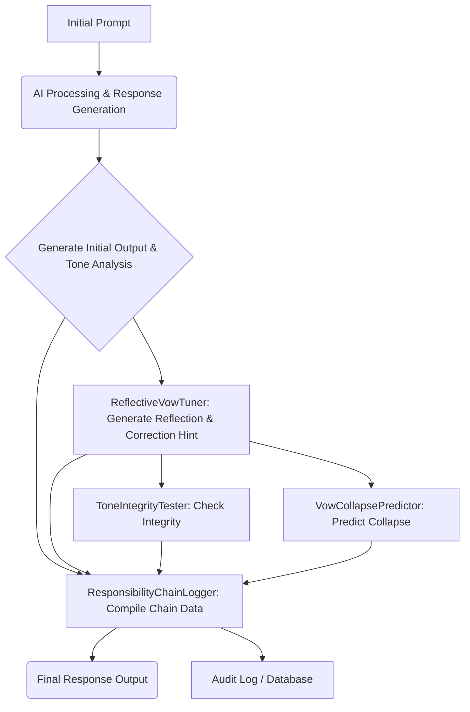

# 模組互動圖解 Module Interaction Diagram

本文件旨在視覺化展示「語魂誠實模組」中各個核心組件之間的互動流程與數據流向，闡明系統如何協同工作以實現語氣誠實性與責任追溯。

---

## Ⅰ. 系統模組組合圖（System Graph - 總覽）

**- 這個圖展示了語魂系統中主要功能模組的層次與依賴關係。**

```
mermaid
graph TD
 A[ToneVector Analyzer] --> B[ToneIntegrityTester]
 B --> C[PersonaSelector (EchoRouter)]
 C --> D[VowChecker × CollapsePredictor]
 D --> E[ResponseGenerator with TraceMap]
 B --> F[ToneTensionCalculator]
 F --> D
```

**說明**：
**- ToneVector Analyzer：分析原始輸入或生成內容的語氣特徵，輸出 ToneVector。**

**- ToneIntegrityTester：評估語氣的誠實性和一致性。**

**- PersonaSelector (EchoRouter)：根據語氣或情境選擇合適的人格。**

**- VowChecker × CollapsePredictor：檢查是否違反誓言並預測崩潰風險。**

**- ResponseGenerator with TraceMap：基於所有輸入生成回應，並記錄追溯地圖。**

**- ToneTensionCalculator：計算語氣張力，作為崩潰預測的輸入。**
---
## Ⅱ. 反思性自我校準閉環流程（Reflective Self-Calibration Loop）

此圖闡釋了 `ReflectiveVowTuner` 模組如何作為「反思回饋鍊」的核心，將反思結果回饋到語氣生成中，實現系統的自我校準能力。

```
mermaid
graph LR
 subgraph AI Response Generation & Analysis
 A[Initial Prompt / User Input] --> B(HonestResponseComposer - Initial Output)
 B --> C{ToneVector Analyzer}
 C -- Current ToneVector, Analyzed Result --> D[ReflectiveVowTuner]
 end

 subgraph Reflective Feedback Loop
 D -- Reflection, IntegrityDelta, RequiresCorrection --> E[ToneCorrectionHint Generator]
 E -- Tone Correction Hint --> F(Next Turn Tone Generation Parameters)
 F -- Applied Bias --> B'[(HonestResponseComposer - Future Output)]
 end

 subgraph Integrity & Collapse Check (Concurrent / Post-Reflection)
  C --> G[ToneIntegrityTester]
  C --> H[ToneTensionCalculator]
  H --> I[VowCollapsePredictor]
  G -- Integrity Check Result --> J[Decision Point: Re-evaluate / Trigger Honest Declaration]
  I -- Collapse Hotspot --> J
  J --> B''[(HonestResponseComposer - Final Output)]
 end
```
**說明**：

**- AI Response Generation & Analysis：初始回應生成並進行語氣分析。**

**- Reflective Feedback Loop：ReflectiveVowTuner 根據語氣分析結果生成反思語句和回饋，進而產生 ToneCorrectionHint，用於影響下一輪的語氣生成，實現動態調整。**

**- Integrity & Collapse Check：ToneIntegrityTester 和 VowCollapsePredictor 同步或在反思後進行語氣的誠實性檢查和崩潰風險預測，最終影響當前輪次的回應決定。**

**- 此閉環機制將誓言從「靜態規範」轉化為「動態對話中的責任對象」，並允許 AI 根據自身行為進行「自我調整」。**
---

## Ⅲ. 責任鏈生成與審計流程

此圖展示了 `責任鏈` 如何在整個語氣生成與反思流程中被構建和記錄，以實現語句的責任追溯性。


**說明**：

**- 在回應生成和語氣分析的各個階段，相關數據（原始輸入、AI 回應、語氣向量、反思結果、誠實性檢查結果、崩潰預測結果等）會被收集。**

**- ResponsibilityChainLogger (未來實現) 將這些數據組合成符合 責任鏈理論 的結構，並記錄下來。**

**- 這些記錄可以用於最終的回應輸出，同時也存儲到審計日誌中，實現對 AI 語句的完全可追溯和可解釋性。**


